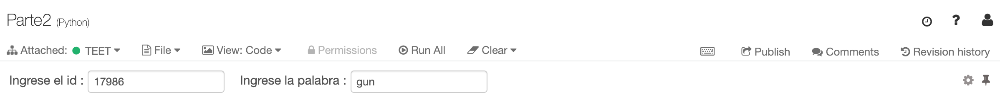
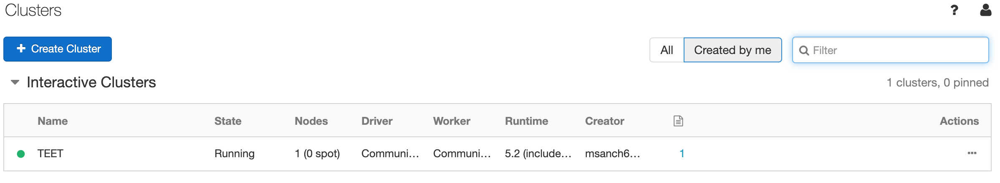
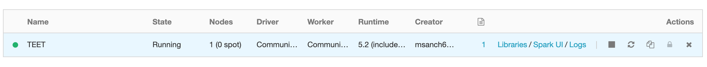
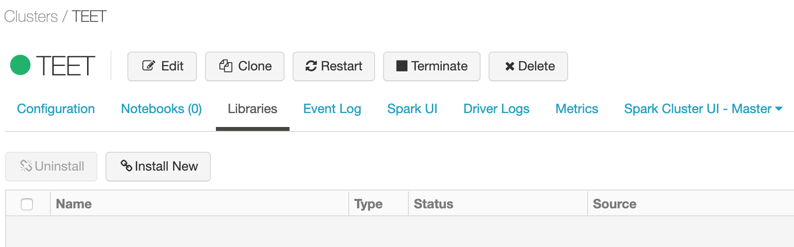
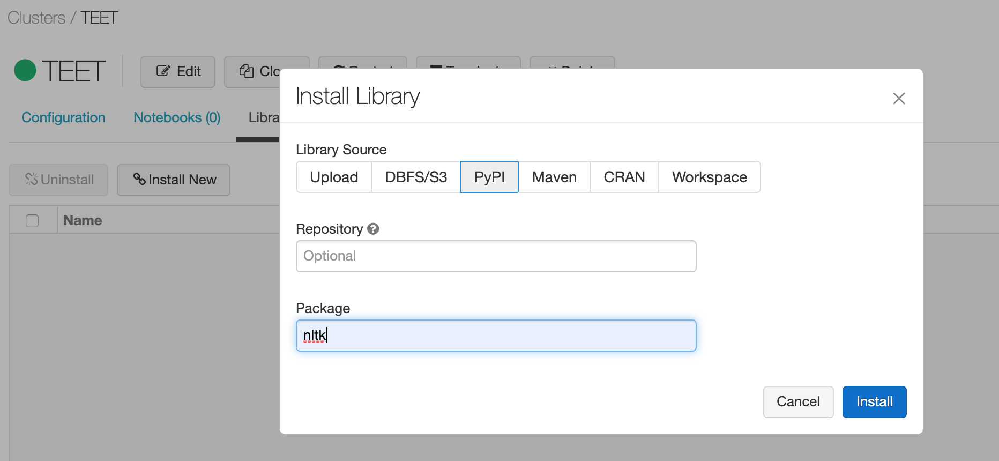
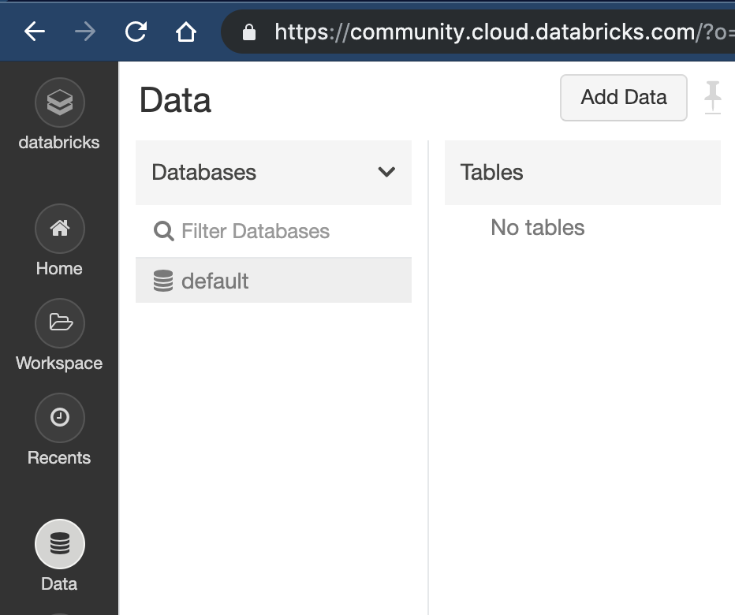
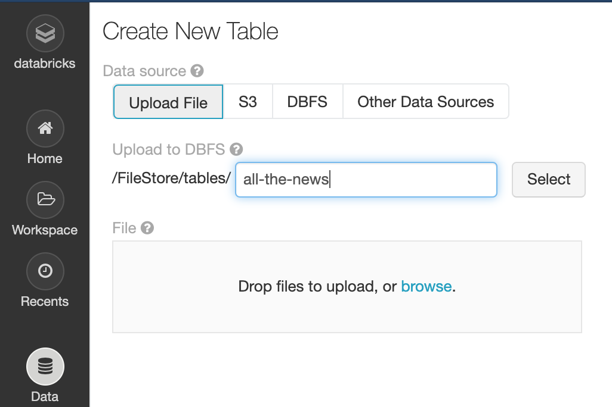
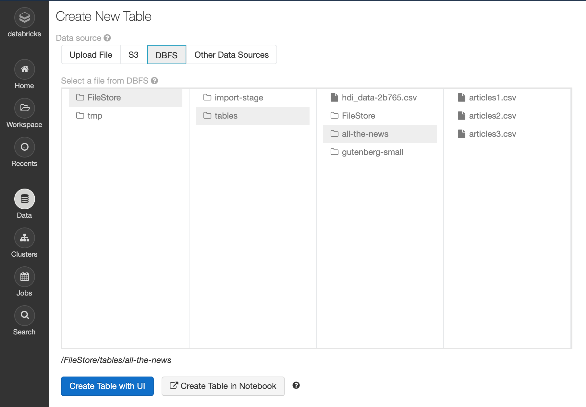
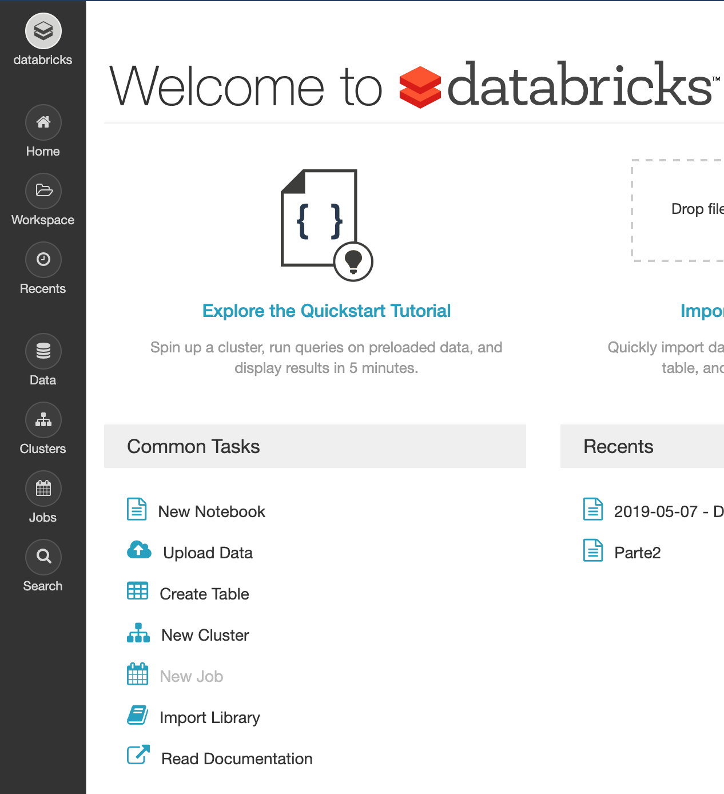
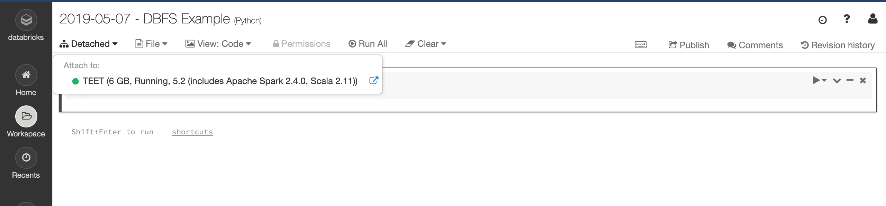

# Tópicos Especiales En Telemática - Proyecto 3 Big Data

## Creado por: Maria Clara Sanchez V, Tomas Alvarez G y Juan Esteban Fonseca P.

  Para este proyecto se realizaron diferentes algoritmos, uno de limpieza de datos, uno de contador de palabras por medio de índice inverso y uno de análisis de semejanza de textos. Todos los algoritmos anteriormente mencionados se basan en la lectura de diferentes Datasets (.csv).

### Limpieza
  
El algoritmo de limpieza funciona quitando todas las stop-words del lenguaje en cuestión de los contenidos de las noticias con la libreria nltk, así como su título, dejando un arreglo de sólo las palabras relevantes las cuales son cruciales para los siguientes pasos.  

* Visualizacion de la data **antes** de la limpieza

````
id: 17283
title: House Republicans Fret About Winning Their Health Care Suit - The New York Times
content: WASHINGTON - Congressional Republicans have a new fear when it comes to their    health care lawsuit against the Obama administration: They might win. The incoming Trump administration could choose to no longer defend the executive branch against the suit, which challenges the administration’s authority to spend billions of dollars on health insurance subsidies for   and   Americans, handing House Republicans a big victory on    issues. But a sudden loss of the disputed subsidies could conceivably cause the health care program to implode, leaving millions of people without access to health insurance before Republicans have prepared a replacement. That could lead to chaos in the insurance market and spur a political backlash just as Republicans gain full control of the government. To stave off that outcome, Republicans could find themselves in the awkward position of appropriating huge sums to temporarily prop up the Obama health care law, angering conservative voters who have been demanding an end to the law for years. In another twist, Donald J. Trump’s administration, worried about preserving executive branch prerogatives, could choose to fight its Republican allies in the House on some central questions in the dispute. Eager to avoid an ugly political pileup, Republicans on Capitol Hill and the Trump transition team are gaming out how to handle the lawsuit, which, after the election, has been put in limbo until at least late February by the United States Court of Appeals for the District of Columbia Circuit. They are not yet ready to divulge their strategy.....
````

* Visualizacion de la data **despúes** de la limpieza
````
id: 17283
title: ['house', 'republicans', 'fret', 'winning', 'health', 'care', 'suit', 'new', 'york', 'times']
content: ['washington', 'congressional', 'republicans', 'new', 'fear', 'comes', 'health', 'care', 'lawsuit', 'obama', 'administration', 'might', 'win', 'incoming', 'trump', 'administration', 'could', 'choose', 'longer', 'defend', 'executive', 'branch', 'suit', 'challenges', 'administration', 'authority', 'spend', 'billions', 'dollars', 'health', 'insurance', 'subsidies', 'americans', 'handing', 'house', 'republicans', 'big', 'victory', 'issues', 'sudden', 'loss', 'disputed', 'subsidies', 'could', 'conceivably', 'cause', 'health', 'care', 'program', 'implode', 'leaving', 'millions', 'people', 'without', 'access', 'health', 'insurance', 'republicans', 'prepared', 'replacement', 'could', 'lead', 'chaos', 'insurance', 'market', 'spur', 'political', 'backlash', 'republicans', 'gain', 'full', 'control', 'government', 'stave', 'outcome', 'republicans', 'could', 'find', 'awkward', 'position', 'appropriating', 'huge', 'sums', 'temporarily', 'prop', 'obama', 'health', 'care', 'law', 'angering', 'conservative', 'voters', 'demanding', 'end', 'law', 'years', 'another', 'twist', 'donald', 'j', 'trump', 'administration', 'worried', 'preserving', 'executive', 'branch', 'prerogatives', 'could', 'choose', 'fight', 'republican', 'allies', 'house', 'central', 'questions', 'dispute', .....]
````

### Contador de palabras

El algoritmo de contador de palabras por medio de índice inverso funciona a partir de una entrada de usuario de una palabra en específico, el algoritmo luego, a partir de esta palabra, usará el arreglo del contenido y título ya limpios para así contar el número de iteraciones que tiene de esta. El output será  de máximo 10 noticias, frecuencia de la palabra de la noticia, identificación de la noticia, título de la noticia.

En Databricks el input del usuario no se hace por consola sino por un cuadro de texto ubicado en la parte superior del Notebook



El output será el siguiente para la palabra **"gun"**:

````
[92, '197639', 'America’s gun problem, explained']
[84, '151360', 'Gun inequality: US study charts rise of hardcore super owners']
[75, '71394', 'Here’s how cops actually trace a gun']
[69, '198595', 'President Obama’s boldest action on guns yet, explained']
[67, '146538', 'Want to fix gun violence in America? Go local.']
[54, '200840', 'The biggest questions about gun violence that researchers would still like to see answered']
[47, '151199', 'More than half of Americans want stricter gun laws, Pew study finds']
[45, '145699', 'Just one in five Americans obtains gun without background check, survey finds']
[45, '195519', 'Study: 1 in 5 gun purchases reportedly go through without a background check']
[43, '158001', 'The uncomfortable truth about gun rights supporters – sometimes they are right']
````
### Clasificación de noticias por similitud


El algoritmo de análisis de semejanza de textos funciona a partir de una entrada de usuario de un id de una noticia, con este se buscará la noticia en cuestión y comparara su frecuencia de palabras con las demás noticias; Entre más palabras comparta una noticia con la noticia en cuestión, el algoritmo determinara que es más probable que sea parecida. el output será el id de la noticia ingresada, su título, un arreglo de 5 id's de las 5 noticias más parecidas.

Este algoritmo tiene 2 partes, la primera (clustering1.py) revisa cada noticia y almacena las 5 palabras que más se repite de esta así:

````
[['17283', [('house', 18), ('republicans', 15), ('administration', 13), ('health', 11), ('trump', 9)]],
['17284', [('precinct', 52), ('said', 46), ('police', 34), ('40th', 28), ('officers', 28)]],
['17285', [('wong', 37), ('mr', 35), ('disney', 15), ('father', 12), ('tyrus', 10)]].....
....]
````
Despúes la segunda parte del algoritmo (clustering2.py) revisa las 5 palabras más repetidas de cada nocticia con respecto a las 5 palabras más repetidas de la noticia ingresada y realiza una suma de la frecuencia de las palabras en común, para luego mostrar las 5 noticias de las cuales se obtuvo la sumatoria mas grande.

El output se ve así:

````
id ingresado: 17986 
titulo del id ingresado: How News on a Times-Affiliated Site Drew Praise From Glenn Beck - The New York Times
id noticias más parecias: ['76862', '18378', '78128', '75386', '75323']
````
## Modo de compilación

Se requiere usar Databricks para la ejecución de estos algoritmos, se deben seguir los siguientes pasos:
* Creacion de cluster

---
* Instalacion de libreria



---
* Cargar los datos



---
* Crear Notebook



